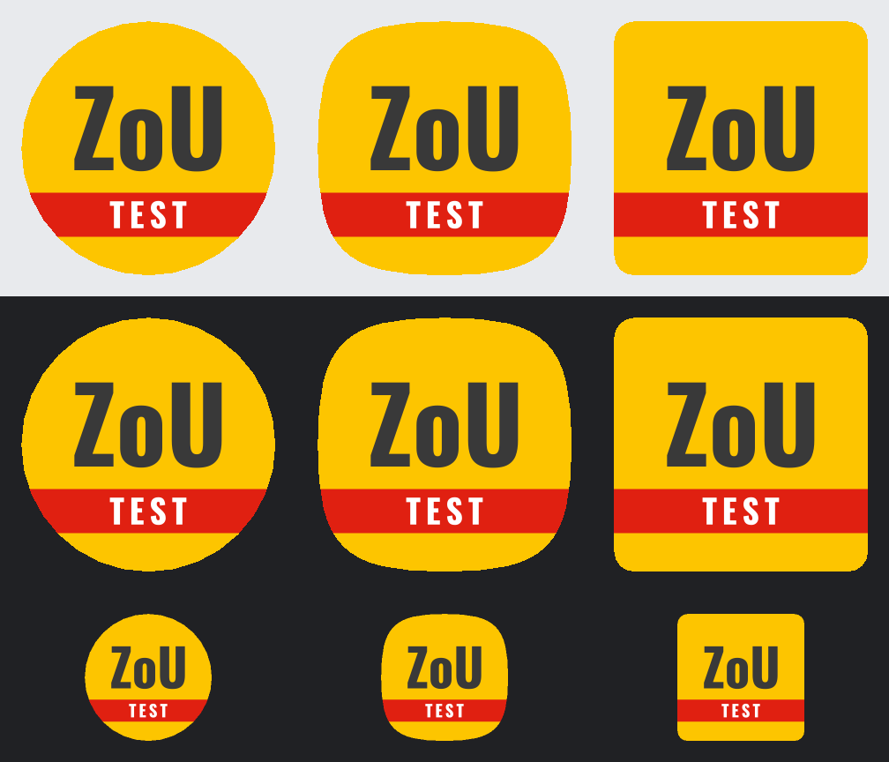

# Cards, the clock, league 6 — build 0.2.0 (2)

**Session date:** 2026-10-07 – 08
**Brief:** `prompts/10-cards-clock-and-league-6.md`
**Repository:** `~/dev/psmf-app` (WSL Ubuntu), branch `main`
**Where it ran:** the Claude desktop app on the Windows host, driving the
`psmf-sandbox` image through a long-lived container
(`docker compose run -d --name psmf-work sandbox sleep infinity`, then
`docker exec … ./gradlew`). Same image, same Gradle cache volume as the usual
in-container session; commits made from WSL with the owner's git identity.
Nothing pushed.
**Outcome:** all four gates met · 4 commits · schema 4 → 6 · league 6 from
psmf.cz, 170 requests · debug APK 0.2.0 (2), 69.95 MB · 436 · 383 · 194 · 23
tests · nothing yet on a phone.

> **What a referee will notice in 0.2.0:** a second yellow now sends the
> player off in one tap, the second half starts at 30´ with the power play
> counting only play, and every team, kit and pitch of league 6 is real —
> each player fielded by typing their date of birth into the lineup, which
> the app then remembers.

---

## 1 · Status at a glance

| | Before (`8bd3c11`) | After |
|---|---|---|
| Second yellow | saved a plain yellow; player stayed on, no power play, report showed two yellows and no red | **one action records ŽK + ČK (2. ŽK)** at the same minute, row shows *Vyloučen*, power play starts, one Undo takes both back |
| Red → 2. ŽK on the sheet | offered for anyone; for a booked player recorded yellow + red, season count 1 | offered **only for a booked player** (and for a named person); records the second yellow too, season count 0 |
| `2. ŽK` in the files | only if the free-text reason happened to say so | **from the stored kind**, TXT/CSV/JSON, reason kept beside it; JSON has `"dismissal"` |
| Power play | ten minutes of wall clock; expired during half-time; started after the final whistle; started for a named person | **ten minutes of play**, held through the interval; none after the whistle or for a named person; nothing shown counting after the whistle |
| Second-half minute | continued from the first half's added time (32´ after a 32-minute half) | **restarts at 30´** |
| `30´+` ordering | after 30´ | **after 29´, before the second half's 30´** — timeline, log, report |
| Undo | last by minute (a card typed late was safe; a same-minute goal was not) | **last recorded**, persisted |
| League player with no RP, no date of birth | could not exist: the league file would not load | **in the squad**; the referee types the date of birth **in their lineup row**, the app writes YYMMDD, the date is remembered and offered next time |
| Schema | version 4 | **version 6** (`4.sqm` three nullable columns; `5.sqm` one new table) |
| League data | one invented group, 6-K, with made-up dates of birth | **league 6 from psmf.cz**: 12 groups, 144 teams, 1,601 players, 792 fixtures, 43 pitches with names and addresses. The invented group is a test fixture |
| Kits | two for every team | as psmf.cz lists them: 55 teams have one, and Týmy says so |
| Android launcher icon | none (`@android:drawable/ic_menu_agenda`) | **the TEST icon**, adaptive, fitted to the safe zone |
| Version | 0.1.0 (1) | **0.2.0 (2)**, Android and the Xcode project |
| Debug APK | 69,710,219 bytes | **69,948,495 bytes** (+238 KB): 52 KB under 70 MB |
| Tests (shared JVM · Android host · composeApp · importer) | 388 · 349 · 182 · — | Gate 1: 415 · 374 · 187 · Gate 2: 428 · 383 · 193 · Gate 3: 436 · 383 · 193 · 22 · Gate 4: **436 · 383 · 194 · 23** |

---

## 2 · Baseline

`./gradlew build :shared:allTests detekt` at `8bd3c11`: **BUILD SUCCESSFUL**.
The first run came from Gradle's build cache, so the three test tasks were
forced to execute (`--no-build-cache` after `clean*Test`), and counted from
their JUnit XML:

| Suite | Tests | Failures |
|---|---|---|
| `:shared:jvmTest` | 388 | 0 |
| `:shared:testAndroidHostTest` | 349 | 0 |
| `:composeApp:jvmTest` | 182 | 0 |

Matches the counts `prompts/10` quotes.

---

## 3 · Gate 1 — cards and the clock

### Method

All the new tests were written first, against `8bd3c11`'s API so that they
failed by assertion rather than by not compiling, and run there: **24 failed,
1 guard passed** (the list is below, with each failure message as it came
out). Then the fixes, then the whole suite. The defect tests live together
in `shared/src/commonTest/.../usecase/CardAndClockReviewTest.kt`, one class
per defect, plus one persistence test and three UI tests where the defect is
on disk or on screen.

Two of the first draft's tests were not good enough and were fixed before
the red run was recorded: the one-undo test passed on `8bd3c11` for the
wrong reason (it never recorded the red, so undoing one yellow "worked") and
now asserts the dismissal first; and the switch-back UI test failed on input
injection, not its assertion — see *Findings*, the locale helper.

### 1 · A second yellow sends the player off, as one action

| Test (failed on `8bd3c11`) | What it said there |
|---|---|
| `SecondYellowTest.aBookedPlayerCardedAgainIsShownSentOffWithTheirSidePlayingShort` | expected ŽK + ČK at 40´, got a lone YellowCard |
| `SecondYellowTest.oneUndoTakesTheSecondYellowAndTheDismissalBackTogether` | the second yellow did not send them off: expected 3 cards, was 2 |
| `SecondYellowTest.choosingRedAndSecondYellowForABookedPlayerAlsoCountsNothingThisSeason` | expected 2 yellows, was 1 |
| `SecondYellowTest.aRedForAPlayerWithNoYellowIsStraight` | expected STRAIGHT, was SECOND_YELLOW |
| `ConsoleScreenTest.beforeSavingTheButtonItselfSaysThisYellowSendsThePlayerOff` | no *Vyloučit (2. ŽK)* on screen |
| `ConsoleScreenTest.aRedForAPlayerWithNoYellowOffersOnlyAStraightRed` | *2. ŽK* chip present |
| guard: `SecondYellowTest.guardANamedPersonGetsNoAutomaticSecondYellow` | passed, as it should |

**Fix.** `LogCard` reads from the match whether the player already has a
yellow and no red. If so, a yellow — or a red marked 2. ŽK — records the
second `YellowCard` **and** a `RedCard(SECOND_YELLOW)`, same minute, same
reason, one shared recording number (defect 5), and the power play. No path
leaves a player on two yellows with no red: `LogCard` is the only writer of
cards, and Undo removes the pair together. `yellowsAccumulatedBy` is
unchanged and returns 0 for that player, as it already did for
yellow + yellow + red.

`CardDraft` takes the booked fact as an argument (`booked`), never as a
field: the match is the source. `offersSecondYellowKind`, `dismissalKind`
and `sendsOffForSecondYellow` derive from it; a red for an unbooked player
*is* straight without being asked. Named persons keep both kinds and no
automatic second yellow, as briefed.

**Judgement call — how the sheet says it before saving.** The save button
stops reading *Uložit* and reads **Vyloučit (2. ŽK)**, bold, in the error
colour; the line above it, which used to say the same thing and change
nothing, now says what saving records (*"Uložení zapíše druhou ŽK i
červenou kartu (2. ŽK) a hráč bude vyloučen."*). The button is where the
thumb is. No second confirmation: one tap sends off, one Undo restores,
which is the cheaper correction at a pitch. Rendered and looked at from a
throwaway JVM Compose capture before committing (both the booked-yellow
sheet and the booked-red sheet). Recorded in `DECISIONS.md`.

### 2 · The report says 2. ŽK from the stored kind

| Test (failed on `8bd3c11`) | What it said there |
|---|---|
| `SecondYellowOnTheReportTest.aSecondYellowRedReadsTwoZkInEveryFileWhateverTheRefereeTyped` | TXT red block did not contain `2. ŽK` |
| `SecondYellowOnTheReportTest.aStraightRedSaysSoInTheJsonAndNeverReadsTwoZk` | no `"dismissal"` in the JSON |
| `ConsoleScreenTest.switchingFromSecondYellowToStraightLeavesNoTwoZkInTheReason` | reason was `2. ŽK` after switching back to straight |

**Fix.** `ZouCard` gains `dismissal: ZouDismissal?`, set by `BuildZouReport`
from `RedCard.dismissal`, serialised in Czech like every other value:
`"2. ŽK"` or `"přímá ČK"` (new `ZouLabels.Cards.STRAIGHT_RED` — the form has
no notation for a straight red, so this is the app's Czech, used only where
the kind must be named). `ZouCard.written` is what TXT and CSV print after
the name: `2. ŽK` for a second-yellow red, with the referee's reason in
brackets when it is anything other than `2. ŽK` itself; the reason verbatim
otherwise. JSON keeps `reason` exactly as typed. Still one encoder —
`ZouDocument.bytes()` is untouched.

At the source: choosing *2. ŽK* on the sheet no longer writes into the
reason, so there is nothing to leave behind when switching back.

**Residual, not fixed:** a 0.1.0 match whose straight red carries the
leftover reason `2. ŽK` still prints `2. ŽK` as that red's reason — the
report does not rewrite what a referee wrote. New sheets cannot produce it.

### 3 · The power play is ten minutes of play

| Test (failed on `8bd3c11`) | What it said there |
|---|---|
| `PowerPlayIsPlayTimeTest.aRedAtTwentyFiveStillLeavesTheSideShortWhenTheSecondHalfKicksOff` | expected 1 short, was 0 |
| `…aRedShownDuringTheIntervalStartsCountingWhenPlayResumes` | expected 1, was 0 |
| `…aRedAfterTheFinalWhistleLeavesNobodyShort` | a power play was started |
| `…aRedWrittenAtSixtyPlusLeavesNobodyShortEvenBeforeTheMatchIsEnded` | a power play was started |
| `…aRedToSomeoneNotInTheLineupLeavesNobodyShort` | a power play was started |
| `…nothingCountsDownOnTheScoreboardOnceTheMatchIsOver` | one still running after FINISHED |
| `…aRedLoggedLateRunsFromTheMinuteTheRefereeWrote` | expected 0 at 30´, was 1 |
| `…aFirstHalfRedLoggedInTheSecondHalfStillSkipsTheInterval` | expected 0, was 1 |

**Fix.** A new value, `PlayClock(kickoffAt, periodBreaks)` in
`MatchClock.kt`, is the one place play is counted; `Match.clock` and
`ConsoleEntry.clock` both build it, which also removes `ConsoleEntry`'s
private copy of the elapsed-time loop. Elapsed play can now be asked about
any instant, not only "now", which is what measuring from a start in the
past needs. `PowerPlay` keeps its stored shape — side, start instant, minute
— so **no column changed meaning**, but `remainingAt`/`isRunningAt` now take
the clock and count play since the start; `endsAt` is gone, because when a
power play ends depends on breaks that may not have happened yet. `LogCard`
starts none for a named person, none when the match is `FINISHED` or
`CONFIRMED`, none for a red written `60´+`; `powerPlaysRunningAt` returns
nothing once the whistle has gone, so the scoreboard shows nothing.

A 0.1.0 power play read back under 0.2.0 gets the new arithmetic for free:
its stored instant was the save moment, which is a valid start.

**Judgement call — a red written earlier than the clock.** The ten minutes
run **from the minute written**, at its start, placed on the clock period by
period (`PlayClock.instantOfMinute`); when the written minute is the one the
clock shows, from the moment of saving. Mapping turned out clean because the
period boundaries are recorded instants: a played minute belongs to the
period whose range holds it (capped at the latest started period, clamped to
that period's end); `30´+` maps to the end of the first period; a minute
later than the clock is clamped to now. The cost is a typo: `4` for `40`
gives a power play already over, and the only sign is its absence. Recorded
in `DECISIONS.md` with the one-line reversal.

### 4 · The second period starts at 30´

| Test (failed on `8bd3c11`) | What it said there |
|---|---|
| `SecondHalfStartsAtThirtyTest.theSecondHalfKicksOffAtThirtyWhateverTheFirstHalfAdded` | expected 30´, was 32´ |
| `…firstHalfAddedTimeComesBeforeTheSecondHalfsThirtiethMinuteInTheLog` | `[30´, 30´+]` |
| `…firstHalfAddedTimeComesBeforeTheSecondHalfsThirtiethMinuteOnTheReport` | `[31´, 30´+]` |
| `…theHalfTimeScoreIsTheFirstHalfsGoalsAndNoneFromTheSecond` | 1:1, expected 1:0 |

**Fix.** `PlayClock.minuteAt`: period *k* shows (*k*−1) × `halfLengthMinutes`
plus whole minutes into the period. `Minute.HalfTime.sortKey` moves from
61 to 59 — after 29´, before the second half's 30´ — which fixes the
timeline, the log (newest first) and `scoreAtEndOfFirstPeriod` in one
place. The timeline now breaks ties within a minute by recording order. The
report's two card blocks are sorted by minute (stably, so one minute keeps
its recording order); goals already were, by construction.

**Assertions of the old behaviour, changed:**

- `MatchClockTest` (`PeriodBreakTest`)
  `startingTheNextPeriodResumesFromWhereTheBreakBegan` → renamed
  `…ResumesPlayFromTheBreakAndTheMinuteFromThirty`. Its elapsed-play
  assertions (32 min at the restart, 57 after 25 more) are **kept** — that
  much play happened, and the power play needs it — the comment "the second
  period continues the same sixty minutes" is gone, and it now asserts the
  minute: `30´` at the restart, `55´` 25 minutes later.
- `ConsoleEntryTest.onceTheSecondPeriodIsRunningAddedTimeIsAnOrdinaryMinuteAgain`:
  **it did not actually pin the old rule** — its first half ended at
  exactly 30:00, where the old and new rules agree. Moved to a 32-minute
  first half and a 3-minute break; it now asserts `64´` where the old rule
  gives `66´`.
- `MinuteTest.halfTimeSortsAfterMinuteThirtyAndBeforeMinuteThirtyOne` →
  `halfTimeSortsAfterMinuteTwentyNineAndBeforeTheSecondHalfsThirty`.

### 5 · Undo takes back the last thing recorded

| Test (failed on `8bd3c11`) | What it said there |
|---|---|
| `UndoByRecordingOrderTest.aGoalScoredInTheSameMinuteAsACardIsWhatUndoTakesBack` | the goal is still there |
| `…aCardWrittenUpLateIsWhatUndoTakesBackEvenAfterALaterGoal` | the goal went instead of the card |
| `MatchPersistenceTest.undoAfterTheAppRestartsStillTakesBackTheLastThingRecorded` | Undo took the card, not the goal recorded after it |
| (the second-yellow undo, under 1) | |

**Fix.** Every `GoalEvent`, `YellowCard`, `RedCard` and `PowerPlay` carries
`sequence: Int?` — the number of the recording action that produced it,
from 1 within the match, `Match.nextSequence()` for the next. A second
yellow's two cards and its power play share one. `UndoLastEvent` removes
everything with the highest number. Events with no number are older than
any that have one and, among themselves, go by the timeline — exactly what
0.1.0's Undo did. Added with the fix, as a guard: undoing a goal no longer
touches an affirmed *Bez karet* (a first draft of the new Undo did — caught
reading the diff, not by a test).

### The migration

**Version 4 → 5**, `shared/src/commonMain/sqldelight/cz/hspinovace/psmf/db/4.sqm`:

```sql
ALTER TABLE goal_record ADD COLUMN sequence INTEGER;
ALTER TABLE card_record ADD COLUMN sequence INTEGER;
ALTER TABLE power_play_record ADD COLUMN sequence INTEGER;
```

Followed the README in order: `generateCommonMainPsmfDatabaseSchema` run
**before** touching a `.sq` file (it rewrote `4.db` byte-identical, sha1
`20c870bf…`, so `4.db` already described the shipped schema); `.sq` edited;
`4.sqm` written; the task run again to record `5.db`;
`verifyCommonMainPsmfDatabaseMigration` green under `check`.

**What an existing match gets for its old rows: `NULL`.** Version 4 kept
no recording order, and the column says so rather than inventing one. The
app reads `NULL` as "recorded before 0.2.0": older than anything recorded
since, ordered among themselves by the timeline. So a match carried across
the update undoes its old events as 0.1.0 would have, and its new ones by
recording order, newest first. `SchemaMigrationTest.aMatchFromZeroPointOneKeepsEveryEventAndUndoesItsOldOnesAsItAlwaysDid`
proves it from the recorded `4.db`: every row survives, Undo takes the 49´
red and its power play, a goal recorded after the update is number 1 and
is the next thing Undo takes.

`SchemaMigrationTest`'s helper had to change. It wrote "old" rows with
today's repository into an old file, which only worked while no migration
had added a column to a table the repository writes; `4.sqm` adds three.
It now writes into a scratch database at the current version and copies
across **only the columns the old table has**. Generic, so the next column
migration does not hit the same wall.

### The stale text

`CLAUDE.md`, the header of `MatchClock.kt` and the KDoc on `Match.kickoffAt`
restated as **no stoppage during play, a recorded interval between
periods**. "No pause, stop, resume or adjust operation during play … and
there must not be one" is kept word for word in strength. The same wording
went into `TECH_STACK.md` §4, `DEMO_SCOPE.md` (the power play line), the
golblok table row in `CLAUDE.md`, and the KDoc of `StartMatch`,
`StartNextPeriod` (which still said "continues the same sixty minutes") and
`ConsoleEntry.minuteAt`.

### Gate 1 against its criteria

| Criterion | |
|---|---|
| Each of the five: failing test, fix, passing run | ✅ 24 failed on `8bd3c11` (above); all pass after |
| The two judgement calls, answered | ✅ above, and `DECISIONS.md` 2026-10-07 |
| The migration: version, what old rows get | ✅ 4 → 5; `NULL`, read as pre-0.2.0 |
| build, allTests, detekt green; counts against the baseline | ✅ clean uncached run: **415 · 374 · 187** (+27 · +25 · +5) |
| Commit | ✅ one commit, this report's first version included |

Detekt's first verdict was four findings (three `ReturnCount` in the new
clock code, one `NestedBlockDepth` in the migration test helper), fixed by
restructuring, not by baseline. The baseline is still empty.

---

## 4 · Gate 2 — a league player with no identification

### The failing test

| Test (failed on `0da6638`) | What it said there |
|---|---|
| `LeaguePlayerWithoutIdentificationTest.aSquadPlayerWithNoIdentificationIsOnTheListButNotYetWithAnEmptyRpColumn` | `IllegalArgumentException: Bílek Ondřej has no RP number, date of birth or birth number. A player who cannot be identified at all cannot be put on a report.` |
| `LineupScreenTest.aPlayerWithNoIdentificationIsGivenADateOfBirthInTheirOwnRow` | the same exception, from building the player |

Both compile against `0da6638` and fail there for the reason the decision
names: such a player cannot be built, so a league file of them cannot
load and nobody can be fielded. The other 17 `LineupScreenTest` tests
passed in the same run. (A first draft built the player as a class property,
which made every test in the class fail; moved into a function so the red
run says which test is about this.)

### What changed

- **`Player`** may be a `LEAGUE_RECORD` with none of the three. An
  `ADDED_AT_PITCH` player still requires a date of birth (in the
  constructor and in the seed loader); `addedAtThePitch()` still takes no RP
  parameter, and nothing typed can become an `RpNumber`.
- **`SquadMemberEntry`** carries `dateOfBirthTyped` (the field's text) and
  `writtenAtThePitch` (what it puts in the column). `identification` is the
  league record's value where it has one, otherwise the date the referee
  typed. `withDateOfBirthTyped` parses with `parseDateOfBirth` — the
  existing `DateOfBirthEntry` reader the add-a-player form uses — and renders
  YYMMDD with the existing `ReportedIdentification.of(LocalDate)`. Half a
  date writes nothing. `needsDateOfBirth` is true whenever the league record
  cannot fill the column, which also covers the old dead end: an RP number
  on file, no card, no date of birth. The "bez RP" toggle is now offered for
  any player with an RP number, since without a date on file it no longer
  leads nowhere.
- **`Appearance.reportedIdentification` is still non-null**, and
  `TeamLineupEntry.problems()` is unchanged: a present player with nothing
  for Číslo RP is still `NoIdentification`, and the block is not written.
- **Remembered on the device**: new table `remembered_date_of_birth`
  (`player_id`, ISO date) beside `jersey_override`, a
  `RememberedDateOfBirthRepository`, and a `RememberDateOfBirth` use case the
  lineup calls whenever a whole, real date is typed. `BuildLineupEntry`
  pre-fills every row from it. A row already saved keeps what it wrote: if
  the remembered date has changed since (at another match), reopening the
  old lineup shows the saved YYMMDD and an empty field, never the new date.
- **The Týmy tab note.** With no RP numbers *and* no dates of birth on file
  — every psmf.cz team — "Do zápisu se pak píše datum narození" implied the
  app had one. It now reads *"PSMF čísla RP ani data narození zatím
  nedodala. Do zápisu se místo čísla RP píše datum narození — rozhodčí ho
  zadá u soupisky."* The old sentence stays for a team that does have dates
  on file.

### What the referee sees, step by step

1. **Soupiska**, a team read from psmf.cz. Each player's row reads
   *Číslo RP: —*, and directly under the name there is a **Datum narození**
   field with the hint *např. 18.5.1992 nebo 18051992*. Players with a date
   on file have no field.
2. They tap the field and type the date as they would write it,
   `18.5.1992` or `18051992`. Under the field the app echoes **18. 5. 1992**
   to check against the player; the line above changes to
   **Číslo RP: 920518**. The referee never types the six digits.
3. A player marked absent (tap the name) loses the field: nobody needs a
   date to not play.
4. *Pokračovat* with a present player still without one: the field turns
   red and the list below says **"Bílek Ondřej: chybí údaj do sloupce Číslo
   RP. Zadejte datum narození v řádku hráče."** The block is not written.
5. The next match with that player: the field already holds `18.5.1992` and
   the column `920518`. They can change it; whatever whole date they type
   becomes the one offered next time. Nothing requires it to match.
6. Reopening an earlier match's lineup shows what was written that day.

Rendered and looked at before committing (an empty row, a typed row, a
half-typed row in error, and a player with a date on file).

### Schema change

**Version 5 → 6**, `5.sqm`: `CREATE TABLE remembered_date_of_birth`. New and
empty; nothing before version 6 could have written into it. `5.db` was
re-recorded before `TeamRecord.sq` was edited (byte-identical), `6.db`
recorded after. `SchemaMigrationTest.aReportWrittenBeforeDatesOfBirthWereRememberedIsIntactAfterItsMigration`
starts from `5.db`; `RememberedDateOfBirthTest` proves the date survives a
restart, the latest one wins, and remembering one does not touch a stored
report.

### Assertions of the old rule, changed

- `PlayerIdentificationTest.aPlayerWhoCannotBeIdentifiedAtAllCannotBeBuilt`
  → `aLeaguePlayerWithNothingOnFileCanBeBuiltButWritesNothingYet`, plus
  `aPlayerAddedAtThePitchCannotBeBuiltWithoutADateOfBirth`.
- `SeedLeagueCatalogTest.aPlayerWithNoIdentificationAtAllIsReported` →
  `aLeaguePlayerWithNoIdentificationAtAllLoads`, plus
  `aPitchAddedPlayerWithNoDateOfBirthIsReported`.
- `BuildLineupEntry` takes the remembered dates as a required argument; the
  eight test call sites pass a `FakeRememberedDateOfBirthRepository`.

`ShippedSeedDataTest` still asserts every *shipped* player can be
identified — true of the invented 6-K until Part 3 replaces it.

### Gate 2 against its criteria

| Criterion | |
|---|---|
| A test that fails on HEAD: a squad player with no identification cannot be fielded at all | ✅ above, two |
| What the referee sees, step by step | ✅ above |
| Schema change, with its migration | ✅ 5 → 6, `5.sqm`, `6.db` |
| Green | ✅ clean uncached run: **428 · 383 · 193** (+13 · +9 · +6 on Gate 1) |
| Commit | ✅ one commit |

Detekt's first verdict: `LineupViewModel.onEvent` at complexity 15 and the
class at 11 functions, both from one added event. Split the row events out
(`handleRowEvent`, the same split `ConsoleViewModel` made) rather than
raising thresholds.

---

## 5 · Gate 3 — league 6 from psmf.cz

The run's own account is `tools/league-import/last-run.md`; the rules are in
the seed README beside the files and in `tools/league-import/README.md`. The
session's calls are in `DECISIONS.md`, 2026-10-07, "What the league import
keys on".

### The importer

`:league-import`, at `tools/league-import/` (`settings.gradle.kts` includes
it with a `projectDir`). A Kotlin Multiplatform module with one `jvm()`
target, so it uses the plugin the catalogue already has; **the only lines
added to `libs.versions.toml` are jsoup 1.23.2**, version and library. It
depends on `:shared` and writes through the app's own seed DTOs, keeping ids
with `SeedIdentity`. `shared`, `composeApp` and `androidApp` gained no
dependency.

| File | Does |
|---|---|
| `PageSource.kt` | the polite, cached fetcher |
| `Pages.kt` | jsoup parsers: league, group, `/dresy/`, team page (fixtures, *Statistiky*, match details), `/hriste/` |
| `Names.kt` | name matching (the words, lowercased, sorted), surname/first-name split, slugs, kit labels |
| `GroupAssembly.kt` | squad, lineups and cards matched to it, yellows through the app's own `yellowsAccumulatedBy` |
| `SeedFiles.kt` | refs, ids kept or minted, the same-name rule, departed refs carried over, venues |
| `SeedJson.kt` | rendering, reading the existing files, loading the output as the app would |
| `ImportReport.kt` · `Main.kt` | `last-run.md`; options and the run |

**Before writing a byte, a run loads its output through the app's own
`SeedLeagueCatalog`**; a run that would not load writes nothing.

Parser tests run against five pages saved on 2026-10-07 and committed under
`src/jvmTest/resources/psmf/`, never against the site: **22 tests** at Gate
3 (`PagesTest`, `NamesTest`, `GroupAssemblyTest`, `SeedFilesTest`), 23 with
Gate 4's fetcher test.

### Polite, and what a run costs

Sequential; at least **1.2 s** between requests, measured from the end of
the previous one; the user-agent `psmf-zou-app-league-import/0.2.0
(internal testing tool for the PSMF Zapis o utkani app; sequential, 1
request/s, cached)` — no personal address in it; every page cached in
`tools/league-import/cache/` (git-ignored) and never fetched again;
`cache/requests.log` lists every request. `robots.txt` disallows only
`/cms/`.

**A full run needs 170 pages**: the league page, `/hriste/`, 12 group
pages, 12 `/dresy/` pages and 144 team pages. On 2026-10-07, 5 of them were
fetched by hand while reading the markup and 165 by the importer: **170
requests to psmf.cz in all, in 4 min 43 s.** An offline re-run made **0**,
took 2 s, and rewrote all 14 files **byte-identical** — every id kept. A
second offline re-run on 2026-10-08, after Gate 4's `asOf` fix, did the
same.

### Counts

| Group | Teams | Players | Fixtures | Played | In detail | With a yellow |
|---|---|---|---|---|---|---|
| 6-A | 12 | 130 | 66 | 24 | 18 | 4 |
| 6-B | 12 | 133 | 66 | 29 | 23 | 9 |
| 6-C | 12 | 132 | 66 | 30 | 24 | 12 |
| 6-D | 12 | 144 | 66 | 30 | 30 | 2 |
| 6-E | 12 | 136 | 66 | 31 | 25 | 11 |
| 6-F | 12 | 123 | 66 | 24 | 18 | 2 |
| 6-G | 12 | 133 | 66 | 29 | 23 | 4 |
| 6-H | 12 | 123 | 66 | 24 | 24 | 4 |
| 6-I | 12 | 142 | 66 | 26 | 26 | 8 |
| 6-J | 12 | 141 | 66 | 24 | 18 | 6 |
| 6-K | 12 | 138 | 66 | 23 | 17 | 2 |
| 6-L | 12 | 126 | 66 | 21 | 16 | 2 |
| **all** | **144** | **1,601** | **792** | **315** | **262** | **66** |

**Every group has 12 teams and 66 fixtures**, so there are no exceptions to
explain. **43 pitches**, league-wide, in `venues.json` with name and
address. Group ids `6a`…`6l`, names *6. liga A*…, report codes `6A`…, 2 × 30.

### What it reported instead of guessing

- **Name matching.** *Statistiky* writes surname first, lineups and cards
  first name first; both are matched on the same words in any order.
  **Unmatched: 0. Ambiguous: 6** — six lineup appearances that fit two rows
  of one squad, because two Tomáš Hrubý play for Sváteční mančaft (6-G) and
  two Miroslav Láník for Hattrick Prosek FC (6-K). None of the six was a
  card, so no count is affected.
- **Ref collisions: 18.** The rule, in the seed README: the first in import
  order keeps the plain slug, a later namesake gets `-<team>`, then
  `-<group>-<team>`. The 18 the first run decided (a re-run keeps them and
  decides nothing, which is why `last-run.md` now lists none):

  | Group | Team | Player | Ref |
  |---|---|---|---|
  | 6-C | Quattro Formaggi | Mrázek David | `mrazek-david-quattro-formaggi` |
  | 6-D | Friends Prague | Zajíček Michal | `zajicek-michal-friends-prague` |
  | 6-D | Ogaři TJ | Macháček David | `machacek-david-ogari-tj` |
  | 6-F | Pivovar Moucha FC | Zima Lukáš | `zima-lukas-pivovar-moucha-fc` |
  | 6-G | Sváteční mančaft | Hrubý Tomáš | `hruby-tomas-svatecni-mancaft` |
  | 6-G | Sváteční mančaft | Hrubý Tomáš | `hruby-tomas-6g-svatecni-mancaft` |
  | 6-H | One Team, One Dream | Novák Lukáš | `novak-lukas-one-team-one-dream` |
  | 6-I | Rapid Libeň | Říha Adam | `riha-adam-rapid-liben` |
  | 6-I | Těsně vedle | Vácha Jan | `vacha-jan-tesne-vedle` |
  | 6-J | Bully ball boys | Kouřímský David | `kourimsky-david-bully-ball-boys` |
  | 6-J | Hells Bells 1.FC | Tichý Petr | `tichy-petr-hells-bells-1-fc` |
  | 6-J | Patapim FC | Novák Michal | `novak-michal-patapim-fc` |
  | 6-K | Hattrick Prosek FC | Láník Miroslav | `lanik-miroslav-hattrick-prosek-fc` |
  | 6-K | Krabice | Kašpárek Jakub | `kasparek-jakub-krabice` |
  | 6-K | Pražská Stoka | Vondráček Jan | `vondracek-jan-prazska-stoka` |
  | 6-K | Strážci Pomeranče | Novák Jan | `novak-jan-strazci-pomerance` |
  | 6-L | Avengers FC | Svoboda Daniel | `svoboda-daniel-avengers-fc` |
  | 6-L | Opat Praha FC | Mareš Jakub | `mares-jakub-opat-praha-fc` |

- **Kits.** Labels verbatim from `/dresy/`, a comma separating a team's
  two; **55 teams list one** and have one. Colours for the app's chips by
  the Czech compound rule — `červeno-černá` gives `červená`, `černá`;
  `světle zelená` stays one colour. **Kit oddities: 0.**
- **Fixture oddities: 0. Name oddities: 0. Departed refs: 0** (a first run
  has nothing to carry over).

### Discipline

**66 players carry a count**, per group above. The markup used `is-yellow`
74 times and `is-red` 11 times. Yellows are counted with the app's own
`yellowsAccumulatedBy`: two in one match count zero, a yellow and a straight
red count one; reds are not counted.

**The site has no marker for a second yellow.** It shows two `is-yellow` and
an `is-red`, three times on 2026-10-07 — once all three at 43´, once 21´ and
22´, once a yellow at 35´ and the other yellow and the red at 55´. A
second-yellow red cannot be told from a straight one, which costs nothing
here because reds are not counted.

`asOf` is 2026-10-07, the day the pages were fetched. **The details lag the
results:** 315 matches have a result and 262 have details, so the cards of
53 matches are in no count yet. Advisory, as the README says.

### Ids

The first run minted every id: the placeholder had already moved out of the
output directory, so none of its ids was read or reused. A re-run reads the
files first and keeps every id whose ref it has seen — the byte-identical
offline re-runs show it on the real data, and `SeedFilesTest` shows it with
teams reordered, a player added and a player gone.

### Venues

`/hriste/` gives each pitch a code, a name and a description whose first
line is the address. `SeedVenueDto.address` and `Venue.address` are new,
optional fields. **No screen shows a pitch's name or address yet**: Zápasy,
the match header and the filter show the code, as before.

### The placeholder retires

`6k.json`, `index.json` and `venues.json` moved (`git mv`) to
`shared/src/jvmTest/resources/placeholder-league/`. **22 tests read the
bundled files; 16 depended on the placeholder** — its names, its UUIDs, its
kickoff times, its one group:

- **14 of `ShippedSeedDataTest`'s 15** moved, unchanged in what they
  assert, to `PlaceholderSeedDataTest` on the frozen copy, with one new
  test that the copy is complete. The 15th, that the seed directory is
  where the app looks, stayed.
- **2 of `ComposeResourceSeedTest`'s 7** were rewritten to assert
  structure: one expected a single group, *6. liga K*; one looked for the
  pitch `ZAKOS`.

The other 6 needed no change. Many UI and domain tests name Kominíci in
their own in-memory data (`UiTestData`, `Fixtures.kt`); they never read the
bundled files. (This section's first version, and the Gate 3 summary to
the owner, said 17 and 15; this is the recount.) New tests on the real files
assert only structure, never a name:

- **`ShippedSeedDataTest.allTwelveGroupsOfLeagueSixLoadThroughTheCatalogue`**
  — the real `SeedLeagueCatalog` on the shipped files — and five more: ids
  unique league-wide, refs unique, every team has a labelled kit, no RP
  numbers, every pitch named.
- **`ComposeResourceSeedTest.allTwelveGroupsOfLeagueSixLoadEndToEnd`** —
  through Compose resources, as the app reads them.

### A match saved against the placeholder

`ObserveReportInProgress` now ignores a match whose fixture is not in league
data; nothing else needed changing. **What the referee sees: nothing of
it.** The Zápis tab is not badged, Zápasy has no row for it, the followed
list is empty, a corrected jersey number corrects nobody. Each screen's own
loader, asked directly, answers "not here" instead of throwing. The match
stays in the database untouched. `PlaceholderMatchAfterTheUpgradeTest`
builds exactly that — a match under way at Kominíci, Kominíci followed,
Růžička's number corrected, all on a database file — then switches to the
real league through the same layers the app uses.

### Gate 3 against its criteria

| Criterion | |
|---|---|
| Counts per group; 66 fixtures each, or why not | ✅ above; all 66 |
| Name-matching failures, ref collisions, kit oddities: listed | ✅ 0 unmatched, 6 ambiguous; 18 collisions; 0 kit oddities |
| The request count and the run time | ✅ 170 requests, 4 min 43 s; 0 from the cache |
| The app loads all twelve groups through the real catalogue (a test) | ✅ two |
| Green; commit, with the generated files | ✅ 436 · 383 · 193 · 22; `2d34329` |

---

## 6 · Gate 4 — the icon, the version, the build

### The icon

**Source:** `iosApp/.../AppIcon-test-1024.png`, read, never modified: yellow
`#FDC500`, "ZoU" in dark grey, a red `#E02011` band at rows 714–914 with
TEST in white.

**What Android gets** (DECISIONS 2026-10-08):

- `res/mipmap-anydpi/ic_launcher.xml`, an adaptive icon. With minSdk 28
  there is no `-v26` qualifier and no legacy bitmaps.
- `ic_launcher_foreground.png` in the five mipmap densities, 108 to 432 px,
  1.5 to 6.3 KB each: the whole picture, opaque. The background is
  `@color/ic_launcher_background`, the same yellow, never seen.
- The manifest's `android:icon` is `@mipmap/ic_launcher` instead of
  `@android:drawable/ic_menu_agenda`. No `roundIcon`: every launcher on API
  28+ masks an adaptive icon itself.

**Fitting it.** The artwork is drawn **64 dp wide** in the 108 dp canvas and
the yellow and the band are carried to the edges. Measured from the source
pixels, the farthest pixel of "ZoU" is **27.2 dp** from the centre and of
"TEST" 24.6 dp; the safe zone's radius is 33 dp.

**Made by** `tools/launcher-icon/LauncherIcon.java`, one file, JDK only, run
in the container (`java tools/launcher-icon/LauncherIcon.java
build/icon-preview`). It also renders the result under three masks.

**Looked at before committing**, under a circle (Pixel), AOSP's squircle
and a rounded square, on light and on dark, and at home-screen size (48 dp):



All of "ZoU" and all of TEST are inside every shape; the band reads as a
stripe across; under the circle a sliver of yellow shows below it. The five
PNGs are in the APK byte for byte, beside `res/mipmap-anydpi-v21/ic_launcher.xml`
(aapt2's qualifier).

Lint: **`MonochromeLauncherIcon`** is new, and accepted — no themed variant
(DECISIONS 2026-10-08). `RedundantLabel` was there before: the activity
repeats the application's label.

### The version

- `androidApp/build.gradle.kts`: `versionCode` 1 → **2**, `versionName`
  0.1.0 → **0.2.0**. The built APK's `output-metadata.json` says so.
- `iosApp.xcodeproj/project.pbxproj`: `CURRENT_PROJECT_VERSION` 1 → **2**
  and `MARKETING_VERSION` 0.1.0 → **0.2.0**, in the target's **Debug**
  (`A1000701`) and **Release** (`A1000702`) configurations. The diff is
  exactly those four lines. No `DEVELOPMENT_TEAM`; nothing else under
  `iosApp/` or `iosMain/` touched. Not built: this machine cannot build iOS.

### The build

`./gradlew :androidApp:assembleDebug` →
`androidApp/build/outputs/apk/debug/androidApp-debug.apk`:

| | Bytes | |
|---|---|---|
| **0.2.0 (2)**, clean package | **69,948,495** | **69.95 MB, 52 KB under 70 MB** (66.71 MiB) |
| 0.1.0 at `8bd3c11`, built from `git archive` | 69,710,219 | |
| Difference | +238,276 | league data +150 KB, code +68 KB, icon and resources +19 KB |

96.6 % of the APK is DEX, stored uncompressed at minSdk 28 (67.6 MB). The
31 MB of `materialIconsExtended` (DECISIONS 2026-09-01) is untouched, as
briefed. **The next session to add anything crosses 70 MB.**

An incrementally packaged build of the same content measured 70,328,455
bytes, 380 KB more (*Findings*). It is signed with the container image's
debug key, certificate SHA-256 `b42076f9…943313ed2a`; installing over 0.1.0
works only if that build was signed with the same key, which is the first
step of *On the phone*.

### Two follow-ups to Gate 3, in this commit

1. **Týmy told 55 teams they own two kits.** *"Tým má dvě sady, první je
   základní"* sat under a single label. Now *"Tým uvádí jen jednu sadu."*
   for those (cs, en, uk). `TeamRosterScreenTest.aTeamThatListsOneKitIsNotToldItOwnsTwo`
   failed first — *"found 1 node … 'Tým má dvě sady'"* — and the two-kit
   test now asserts its note too.
2. **The importer stamped `asOf` with the day of the run.** Found by
   accident: an offline re-run on 2026-10-08 rewrote all 14 files, every
   count now "as of" the 8th though every page was fetched on the 7th
   (reverted, never committed). `asOf` is now the day the **oldest page
   read** was fetched — a cached page's file time — and `--as-of` still
   overrides. `PoliteCachedFetcherTest` failed first (no such thing); the
   re-run that followed rewrote the 14 files byte-identical. The same
   re-run's `last-run.md` now names its suffix list for what it is: what
   *that run* decided.

### Gate 4 against its criteria

| Criterion | |
|---|---|
| The masked icon, looked at | ✅ above, three masks, light and dark, home-screen size |
| Version numbers, both platforms | ✅ 0.2.0 (2); four lines in `project.pbxproj` |
| The APK path and size | ✅ 69,948,495 bytes, 52 KB under 70 MB |
| Green; commit | ✅ clean uncached run: **436 · 383 · 194 · 23**, detekt and lint green; one commit |

---

## 7 · Decisions taken, and by whom

| Decision | By |
|---|---|
| The five card-and-clock fixes and what each must do | Owner, `DECISIONS.md` 2026-10-07 |
| The save button reads *Vyloučit (2. ŽK)* for a booked player | This session, asked for by the brief; `DECISIONS.md` |
| A late-logged red runs from the minute written | This session, asked for by the brief; `DECISIONS.md` |
| Old rows get `NULL`, read as "before 0.2.0, by the timeline" | This session |
| JSON spells a straight red `přímá ČK` | This session |
| A named person keeps both red kinds (no automatic second yellow, but the referee can still record one) | This session, reading "leave them as they are" |
| A league player may arrive with none of the three; the referee writes the date of birth | Owner, `DECISIONS.md` 2026-10-07 |
| The date field sits under the name in the row, outside the tap that marks absence | This session |
| A remembered date is replaced by the latest whole date typed; clearing the field forgets nothing | This session |
| A saved row keeps its written value even when the remembered date changes later | This session |
| The "no card" toggle is offered for any player with an RP number | This session |
| Scrape league 6, all twelve groups, politely, for internal testing | Owner, `DECISIONS.md` 2026-10-07 |
| The importer's shape: a KMP `jvm()` module on `:shared`, loading its own output before writing | This session, inside the brief |
| A fixture's ref is its pairing; a player's is the name, a later namesake gets `-<team>` | This session; `DECISIONS.md` 2026-10-07 |
| Departed refs carried over; unmatched and ambiguous names reported, never guessed | Brief; carried out here |
| A match saved against the placeholder is kept and offered nowhere | This session; `DECISIONS.md` 2026-10-07 |
| `asOf` is the day the oldest page read was fetched, not the day of the run | This session, Gate 4 |
| A pitch's address is the first line of its `/hriste/` description | This session |
| Kit colours by the Czech compound rule; labels verbatim | Brief; the rule, this session |
| Týmy says so when a team lists one kit | This session, Gate 4 |
| Android gets the TEST icon | Owner, `DECISIONS.md` 2026-10-07 |
| The artwork 64 dp wide; no monochrome layer | This session; `DECISIONS.md` 2026-10-08 |
| 0.2.0 (2) | Brief |

---

## 8 · Findings worth not rediscovering

1. **`withLanguage("cs")` in the UI tests restores the default locale when
   its block returns.** A test that clicks *after* the block recomposes in
   English, and `onNodeWithText("Přímá ČK")` finds nothing. Clicks that
   recompose belong inside the block. *Already written down* in the KDoc of
   `withLanguage` in `UiTestData.kt` ("Wrap the whole test, not just
   `setContent`") — this session rediscovered it anyway, which is the
   argument for listing it here too.
2. **A migration that adds a column breaks "write old rows with today's
   code".** `SchemaMigrationTest` now transplants only the old table's
   columns; see above.
3. **The 2026-09-01 report says the console read `0´` at the second half's
   kickoff.** At `8bd3c11` it read the first half's elapsed time (`32´`
   after a 32-minute half). Neither is the rule now: `30´`.
4. **The match log is in minute order; Undo is in recording order.** For
   everything logged live they agree. A card typed in as 22´ after a goal
   at 25´ sits *below* the goal in the log and is still what Undo takes.
   Worth a referee's opinion.
5. **A dialog can be looked at without an emulator:**
   `onNode(isDialog()).captureToImage().toAwtImage()` in a JVM Compose test,
   written to a PNG. Used here for the card sheet; not committed.
6. **The edit tool, writing through `\\wsl.localhost`, left CRLF in two
   Markdown files** (`.kt` files were unaffected). `git ls-files --eol`
   shows it; `text=auto` would have normalised it at commit, but the working
   copy would have stayed CRLF.
7. **`Minute.HALF_LENGTH` is still a constant** (DECISIONS 2026-09-01). With
   `30´+` now sorting before 30´, a 2 × 25 competition would sort its
   second half's 25´–29´ before `30´+` and count them in the half-time
   score. True before this change as well; still only a problem outside HL.
8. **psmf.cz has no marker for a second-yellow red.** Two `is-yellow` and an
   `is-red`, sometimes at different minutes. Anything that ever counts reds
   from the site has to infer the kind.
9. **Match details lag results.** On 2026-10-07, 53 of 315 played matches
   had a score and no details, so no cards. `asOf` cannot express that.
10. **A debug APK's size depends on its build history.** AGP packages a
    debug APK incrementally, in place, and leaves gaps: the same content
    measured 70,328,455 bytes after an incremental build and 69,948,495
    after `:androidApp:clean`. Compare sizes only from a clean package.
11. **A baseline build of any commit costs seconds.** `git archive <commit>
    | tar -x -C build/<dir>`, copy `local.properties`, run Gradle there; the
    build cache does the rest (19 s for 0.1.0's APK here).
12. **The seed README ships inside the APK**, as
    `assets/composeResources/.../files/leagues/README.md` (10 KB, 5 KB
    compressed): Compose resources pack the directory whole. It always has;
    harmless.
13. **Real kickoffs are not what the placeholder assumed:** weekday evenings
    from 17:30, and Sundays from 10:00 — 133 of the 792 fixtures. Still on
    15-minute steps.
14. **Pitch names and addresses are in the data and on no screen.** Every
    screen shows the code.
15. **Two players of one name in one squad cannot be told apart** in the
    lineup until a date of birth is typed for one of them: no RP number, no
    date, no jersey number on the site. Two such pairs in league 6.

---

## 9 · Open items and known gaps

- **Nothing in 0.2.0 has been on a phone.** *On the phone*, below.
- **iOS 0.2.0 (2) is numbered, not built.** The Mac builds and uploads it
  (`docs/TODO.md`).
- **The debug APK is 52 KB under 70 MB.** `materialIconsExtended` is the
  31 MB answer, out of this brief.
- **No themed icon** (DECISIONS 2026-10-08).
- **The data is public but internal-only**: a store build waits for A10 and
  A26 (DECISIONS 2026-10-07).
- **Yellow counts trail the site** by the 53 matches without details, and
  six lineup appearances in league 6 belong to nobody (the same-name
  pairs).
- From Gate 1: a 0.1.0 straight red whose reason is `2. ŽK` still prints
  it; `Minute.HALF_LENGTH` is still a constant.
- Not this session, as briefed: the `BackHandler` and `TabRow`
  deprecations, minutes counted from 0 and `62´` against `60´+`, and the
  `Version.xcconfig` proposal.

---

## 10 · On the phone

For the owner and the tester, on Android, with this APK. Each step: what to
do, what should happen, and what failure looks like. Do them in order: the
first steps are the upgrade test, and they only work once.

### The upgrade

1. **Install over 0.1.0. Do not uninstall it first.** `adb install -r
   androidApp-debug.apk`, or open the APK on the phone. **Expected:** it
   installs as an update; *Settings → Apps → Zápis o utkání* says version
   0.2.0. **Failure:** *App not installed* or *package conflicts with an
   existing package*: the old build was signed with a different debug key
   (this one's certificate SHA-256 ends `943313ed2a`). Stop there and
   report it — uninstalling would erase the 0.1.0 data and the upgrade test
   with it.
2. **The home screen.** **Expected:** the TEST icon — yellow, dark "ZoU",
   a red band with white TEST — whole inside the launcher's shape, named
   *Zápis o utkání*. **Failure:** the old system agenda icon or a generic
   Android one; "ZoU" or TEST cut by the shape. If themed icons are on
   (Android 13+), write down what the launcher shows instead.
3. **Open the app and every tab.** A match recorded in 0.1.0 was against
   the invented 6-K, which is gone: it stays in the database untouched and
   is offered nowhere. **Expected:** no crash anywhere; the Zápis tab is not
   badged even if a 0.1.0 match was in progress; Týmy's followed list is
   empty even if you followed Kominíci; no Kominíci anywhere. Files exported
   from 0.1.0 are still in your folder. **Failure:** a crash, a badge that
   opens nothing, or any invented team.
4. **Settings → *Ukládání zápisu*.** If you chose a folder in 0.1.0:
   **Expected:** *Změnit složku*, the folder kept. **Failure:** *Vybrat
   složku*.

### Real league data

5. **Zápasy, filtered to *6. liga K*.** **Expected:** 66 fixtures in 11
   rounds; round 1 begins with Krabice – Pražská Stoka, Sunday 6 September
   2026 at 10:00, pitch ZAK. The other eleven groups, A to L, are there too.
   **Failure:** fewer groups, a group without 66 fixtures, an invented name.
6. **Týmy → Krabice.** **Expected:** nine players from psmf.cz, each
   *Číslo RP: —*; one kit, *pistáciovo-černá*, with the note *Tým uvádí jen
   jednu sadu*; *PSMF čísla RP ani data narození zatím nedodala…*.
   **Then Hattrick Prosek FC:** two kits, *fialová · červeno-černá*, with
   *Tým má dvě sady…*, and two players called *Láník Miroslav* — that is
   real. **Failure:** *dvě sady* under Krabice; a squad that is not the
   site's.

### Fielding a real player by date of birth

7. **Zápasy → Krabice – Pražská Stoka →** through the header to Krabice's
   lineup. **Expected:** each row has a *Datum narození* field under the
   name. Type `18.5.1992` for one player: **18. 5. 1992** appears under the
   field and the row reads **Číslo RP: 920518**. **Failure:** no field, or
   any other six digits.
8. Mark all but three players absent (tap the name); their fields go. Give
   two of the three a date, leave the third empty, *Pokračovat*.
   **Expected:** the empty field turns red and the list says *…: chybí údaj
   do sloupce Číslo RP. Zadejte datum narození v řádku hráče.* Type a date;
   *Pokračovat* now goes through. **Failure:** a lineup confirmed with an
   empty Číslo RP, or refused with all three dates in.
9. Same for Pražská Stoka. Three players a side is enough for everything
   below.
10. **Offered next time:** open Krabice's round-2 fixture and its lineup.
    **Expected:** the three dates are already in their fields and the column
    shows their YYMMDD. **Failure:** empty fields.

### The match

11. *Zahájit utkání*. In the first minute or two, a **yellow** (ŽK) for a
    Krabice player.
12. **Second yellow.** The same player, *Karta*, ŽK. **Expected before
    saving:** the line *Uložení zapíše druhou ŽK i červenou kartu (2. ŽK) a
    hráč bude vyloučen.* and the button **Vyloučit (2. ŽK)**, in red. **One
    tap.** **Expected after:** the log has ŽK and ČK *2. ŽK* at the same
    minute; the row says *Vyloučen*; the scoreboard says *Oslabení: Krabice,
    zbývá 9:5x*. **Failure:** a second plain ŽK, the player still in play,
    no *Oslabení*.
13. **One undo restores.** *Vzít zpět*, once. **Expected:** the second ŽK
    and the ČK both go; the player is back in play with one ŽK; *Oslabení*
    is gone. **Failure:** one card of the two left behind, or *Oslabení*
    still there.
14. Give the second yellow again (step 12) — it is needed in the CSV.
15. **Undo of same-minute events.** Within one minute: a ŽK for a Pražská
    Stoka player, then a goal. *Vzít zpět*. **Expected:** the goal goes and
    the score drops back; the card stays. **Failure:** the card goes and the
    goal stays.
16. **A red before half-time.** A straight red (ČK, any reason) for another
    Pražská Stoka player. Note the time *Oslabení* shows. After a minute,
    *Ukončit poločas*; wait two minutes; *Zahájit 2. poločas*.
17. **The second half starts at 30´, and the red still counts.**
    **Expected:** the clock reads **30´** at the restart; *Oslabení* for
    Pražská Stoka is still shown with what it had at the whistle, counting
    down again. **Failure:** 31´ or more, or 0´; *Oslabení* gone, or short
    by the length of the interval.
18. **A red after the final whistle starts nothing.** *Ukončit utkání*.
    Then a straight red for a player still in play. **Expected:** the row
    says *Vyloučen*; no new *Oslabení* appears, and none is counting.
    **Failure:** an *Oslabení* line after the whistle.

### The report: 2. ŽK, save, cancel, send

19. *Pokračovat* and complete the report — officials, the cards section,
    commentary, the Č/B assessments, the result, the three confirmations —
    until *Odeslání* says *Zápis je kompletní a připravený k odeslání*. (Save
    and send appear only then.)
20. ***Uložit do zařízení.*** **Expected:** *Zápis uložen…*, with no folder
    question if one was kept in step 4.
21. **2. ŽK in the saved CSV.** Open the CSV from that folder (a file
    manager, or a spreadsheet app). **Expected:** in the red-card block, the
    second-yellow red reads **`2. ŽK`** — with your reason in brackets if you
    typed one other than 2. ŽK — and the straight reds read their reasons;
    both of that player's yellows are in the yellow block. **Failure:** the
    second-yellow red shows only a typed reason, or `2. ŽK` is nowhere.
22. **The "cancelled" message** (from the `ios/export` merge). In a file
    manager, rename or delete the folder the app saves into. *Uložit do
    zařízení* again → the folder picker opens → back out without choosing.
    **Expected:** ***Uložení zrušeno. Nic nebylo uloženo.*** **Failure:**
    *Uložení se nezdařilo…* (the old wording covered both), no message, or
    files written somewhere. Then save again and pick a folder: *Zápis
    uložen…*.
23. **Send** (from the same merge). *Odeslat na PSMF* → choose the mail app.
    **Expected:** a draft **To: psmf@psmf.cz**, subject `ZoU …`, the text
    report as the body, **three attachments** (`.txt`, `.csv`, `.json`); back
    in the app, *Otevřen e-mail na psmf@psmf.cz. Odeslání potvrďte v poštovní
    aplikaci.* **Do not send it to PSMF:** change To to your own address, or
    discard the draft. With no mail app at all: *Na tomto zařízení není
    poštovní aplikace…*. **Failure:** fewer than three attachments, an empty
    To, or no message on return.

---

## 11 · Commits

| Gate | Commit |
|---|---|
| 1 | `0da6638` — Fix the five card and clock defects; schema 5 records the order things were recorded in |
| 2 | `9105514` — Let a league player arrive with no identification; schema 6 remembers the date of birth |
| 3 | `2d34329` — Import league 6 from psmf.cz; the invented 6-K retires to a test fixture |
| 4 | *this commit* — The Android TEST icon and build 0.2.0 (2); Týmy and the importer's `asOf` put right |

Nothing pushed: the container cannot, by design.
